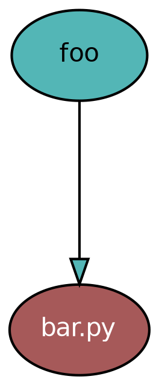

This is kind of obvious, but I think it is often skipped over for more complicated solutions: you can pass data from module-to-module using imports. This approach to [modular design](https://en.wikipedia.org/wiki/Modular_design) via [modular programming](https://en.wikipedia.org/wiki/Modular_programming) allows us a lightweight way to selective execution of code modelled as a directed acyclic graph (DAG).

## Toy Example

Let's look a small example involving two modules `foo` and `bar`. In this example we load data into `foo`.


```python

```

And let's define `bar` as a module which does some data processing.

```python

```

Although it is a toy example, this illustrates a way of building out a Python data science project using module imports. We could build out various modules to be responsible for different things, and pass data through imports accordingly.

## LSP

One of the extrinstic aspects of this approach that I enjoy is the opportunity to lean heavily into language server protocol (LSP) support in editors. Want to find where a Python variable came from in your project? Use LSP go to definition. Want to find, or look through, all the places where a Python variable is used? Use LSP go to reference. Want to rename a variable consistently throughout the code? Use LSP rename.

##  Module Dependencies

LSPs will allow you to efficiency navigate with respect to a given variable under our cursor.

One of the extrinstic aspects of this approach that I enjoy is the opportunity to lean heavily into language server protocol (LSP) support in editors. Want to find where a Python variable came from in your project? Use LSP go to definition. Want to find, or look through, all the places where a Python variable is used? Use LSP go to reference. Want to rename a variable consistently throughout the code? Use LSP rename.

Imports form a dependency graph in the form of a directed acyclic graph. There are tools for extracting this structure. A project still being maintained for over a decade is the [`pydeps`](https://github.com/thebjorn/pydeps) Python package. 



It can provide a bird's-eye view of how modules are related to each other via imports. There is also the `ruff analyze graph` which is currently experimental but released for use. If you're using ruff anyway, you can also use the [`include-dependencies`](https://docs.astral.sh/ruff/settings/#analyze_include-dependencies) to explicit map out dependencies that are *not* visible via imports.


## Full(er) Example

Let's look at a more involved example now using a design which will accomodate the project becoming large.
